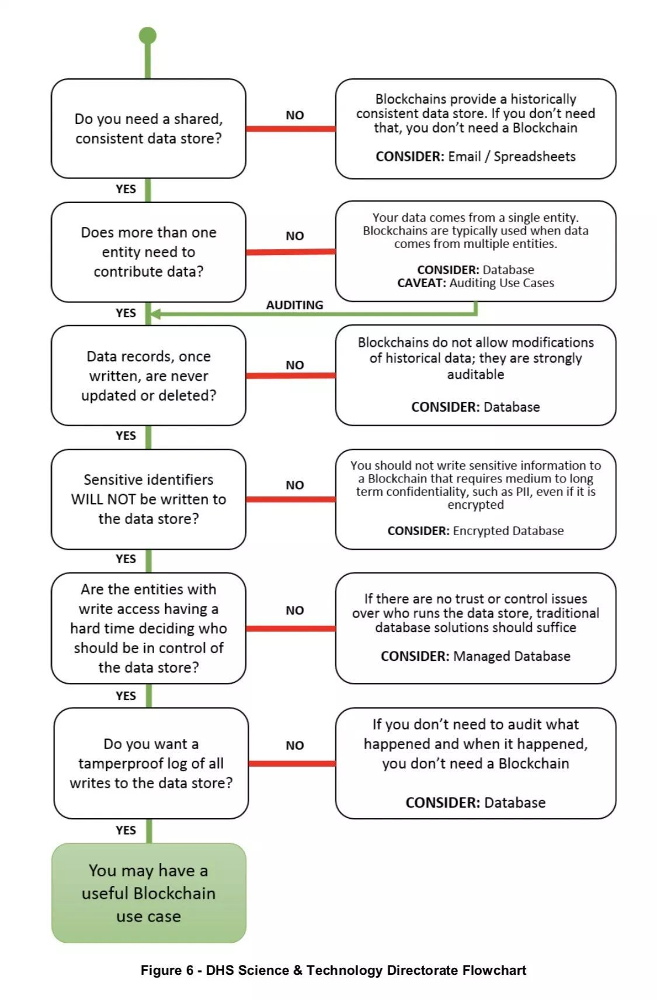

## Hello World

#### Gentle alternatives
- For tracking data needs

#### Tweets about this
- https://twitter.com/rightsduff/status/1081666419446743040
- https://twitter.com/anthonygarvan/status/1081896764825878528

#### Resources to pull from

- http://merltech.org/blockchain-for-international-development-using-a-learning-agenda-to-address-knowledge-gaps/
- [NIST Report](https://webcache.googleusercontent.com/search?q=cache:SzDDhGMLg5sJ:https://nvlpubs.nist.gov/nistpubs/ir/2018/NIST.IR.8202.pdf+&cd=1&hl=en&ct=clnk&gl=us)
